# BÁO CÁO LAB 1 — CSE457 Xử lý âm thanh và tiếng nói
## Phân tích và xử lý tín hiệu âm thanh số

| | |
|---|---|
| **Tệp dữ liệu** | `audio/input.mp3` — freesound_community-entertainment-72974.mp3 |
| **Môi trường** | Python 3, NumPy, SciPy, Matplotlib, SoundFile, Pydub + ffmpeg |
| **Toàn bộ số liệu trong báo cáo này** | sinh trực tiếp từ notebook, lưu trong `results_summary.json` |

> **Quy ước dB dùng trong báo cáo:** `dBFS` = so với full-scale 1.0; `dB (tương đối)` = so với đỉnh lớn nhất
> của chính phổ đó; `SNR dB` = tỉ số công suất tín hiệu / công suất sai số.

---

## 1. Metadata và chuẩn bị dữ liệu (khối A)

| Thuộc tính | Giá trị đo được |
|---|---|
| Định dạng | MPEG-2 Layer III (MP3), Joint Stereo |
| Kích thước tệp | 308,160 byte (0.308 MB) |
| Sampling rate F_s | **24,000 Hz** → T = 1/F_s = 41.667 μs |
| Tần số Nyquist | **12,000 Hz** |
| Số kênh C | 2 (stereo), tương quan L–R = 0.904 |
| Bit/mẫu sau khi giải mã | 16 bit (`sample_width` = 2 byte) |
| Thời lượng | 15.408 s — 369,792 mẫu/kênh |
| Bit rate MP3 đo được | 160.0 kbps |

**Mức tín hiệu sau khi chuẩn hóa về [-1, 1]:**

| Kênh | Peak | Peak (dBFS) | RMS | RMS (dBFS) | Energy E=∑ x^2 |
|---|---|---|---|---|---|
| L | 0.8904 | −1.01 | 0.0849 | −21.42 | 2666.3 |
| R | 0.8766 | −1.14 | 0.0861 | −21.30 | 2740.2 |
| Mono = (L+R)/2 | 0.8679 | −1.23 | 0.0834 | −21.58 | 2572.9 |

**Nhận xét.**

1. Fs = 24 kHz nên **băng tần biểu diễn được tối đa chỉ tới 12 kHz**. Mọi thành phần trên 12 kHz của bản
   thu gốc đã bị loại bỏ trong quá trình mã hóa và **không thể phục hồi** — đây là ràng buộc vật lý của định lý
   lấy mẫu, không phải giới hạn của công cụ phân tích.
2. Con số "16 bit/mẫu" là **thuộc tính của bộ giải mã**, không phải của tệp MP3. MP3 lượng tử hóa không đều
   trong miền tần số theo từng sub-band nên không có khái niệm bit/mẫu cố định. Vì vậy trong phần G,
   PCM 16-bit chỉ được dùng làm **mốc quy chiếu không nén**, không phải "bản gốc không mất mát".
3. Hai kênh tương quan cao (0.904) nên mono hóa bằng trung bình không gây triệt tiêu pha đáng kể:
   RMS mono chỉ thấp hơn kênh trái 0.15 dB.

---

## 2. Phân tích miền thời gian (khối B)

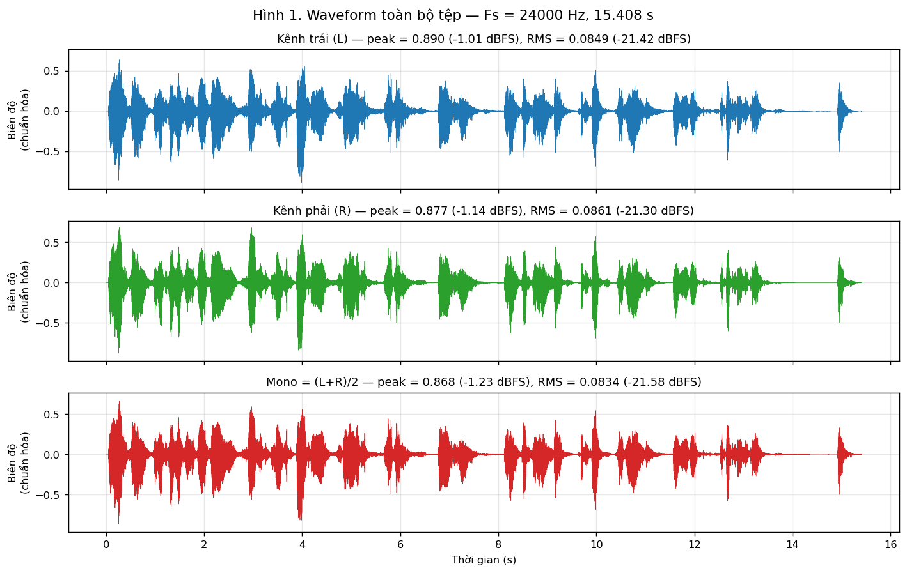
*Hình 1. Waveform toàn bộ tệp — kênh L, kênh R và bản mono.*

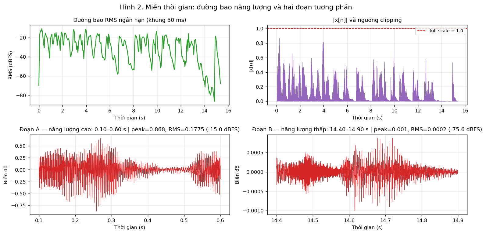
*Hình 2. Đường bao RMS ngắn hạn (khung 50 ms), kiểm tra clipping và hai đoạn tương phản.*

| Đại lượng | Giá trị |
|---|---|
| Số mẫu chạm full-scale (∣x∣≥0.999) | **0 → không clipping** |
| Headroom còn lại | 1.23 dB |
| Crest factor (peak − RMS) | **20.34 dB** |
| Đoạn A (0.10–0.60 s), năng lượng cao | peak 0.868, RMS 0.1775 (**−15.02 dBFS**), E = 378.1 |
| Đoạn B (14.40–14.90 s), năng lượng thấp | peak 0.0010, RMS 0.000167 (**−75.56 dBFS**), E = 3.3×10⁻⁴ |
| Chênh lệch A − B | **60.5 dB** |

**Nhận xét.**

1. Không có clipping, còn 1.23 dB headroom → tệp đã được master ở mức an toàn, mọi phép xử lý tuyến tính
   phía sau không bị méo do tràn biên.
2. Crest factor ≈ 20 dB là đặc trưng của nhạc nhiều transient (gảy/gõ): đỉnh cao gấp ~10 lần mức hiệu dụng.
   **Peak và RMS phải đọc cùng nhau** — chỉ nhìn peak sẽ tưởng tín hiệu rất to, trong khi
   σ_x  thật sự chỉ ở −21.58 dBFS. Con số này sẽ giải thích trực tiếp kết quả SNR lượng tử ở phần 6.
3. Đường bao RMS cho thấy cấu trúc nhịp lặp lại rõ và một đoạn tắt dần gần như im lặng ở cuối tệp
   (chênh 60.5 dB so với đoạn to nhất). Đây chính là lý do **không được dùng một FFT duy nhất cho cả tệp**:
   phổ trung bình sẽ trộn lẫn hai chế độ hoàn toàn khác nhau.
4. Đoạn B (rất nhỏ tiếng) là nơi nhiễu lượng tử ở phần 6 sẽ lộ ra rõ nhất, vì không còn tín hiệu mạnh để che
   (masking) nó.

---

## 3. Phân tích miền tần số bằng FFT (khối C)

Đoạn phân tích: **1.62–2.62 s** (1.0 s = 24,000 mẫu), chọn tự động là cửa sổ 1 s có RMS ngắn hạn ổn định nhất,
nhân cửa sổ Hamming trước khi tính FFT.

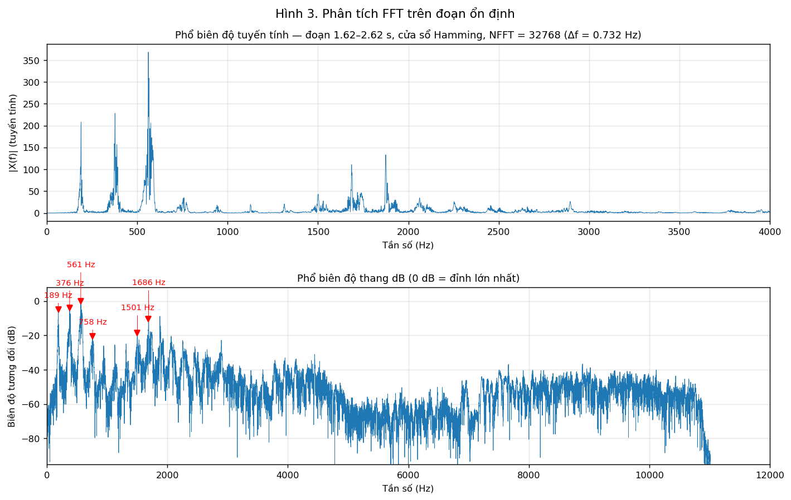
*Hình 3. Phổ biên độ tuyến tính và thang dB của đoạn ổn định.*

**Độ phân giải:**

| NFFT | Δf = F_s/N_{FFT} | Số bin (0 → 12 kHz) |
|---|---|---|
| 2,048 | 11.719 Hz | 1,025 |
| 8,192 | 2.930 Hz | 4,097 |
| 32,768 | 0.732 Hz | 16,385 |

**Độ phân giải THỰC** (do cửa sổ Hamming dài L = 24,000 mẫu quyết định): ≈F_s/L = 2.00 Hz.

**Các đỉnh phổ nổi bật (NFFT = 32768):**

| # | Tần số (Hz) | Mức (dB tương đối) | Tỉ lệ với f_0 |
|---|---|---|---|
| 1 | 188.96 | −4.95 | 1.00 |
| 2 | 376.46 | −4.16 | 1.99 |
| 3 | **561.04** | **0.00** (đỉnh mạnh nhất) | 2.97 |
| 4 | 758.06 | −20.40 | 4.01 |
| 5 | 1501.46 | −18.64 | 7.95 |
| 6 | 1686.04 | −10.44 | 8.92 |
| 7 | 1718.26 | −17.84 | 9.09 |
| 8 | 1875.00 | −8.83 | 9.92 |

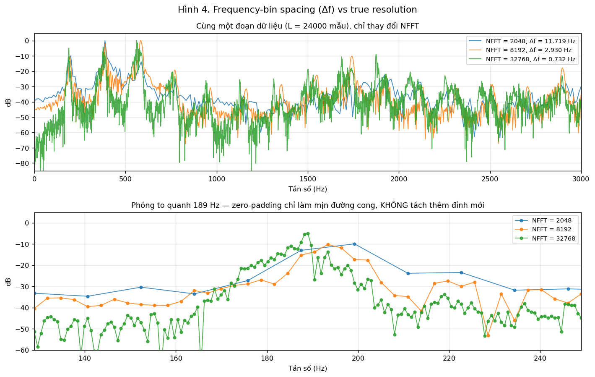
*Hình 4. Cùng một đoạn dữ liệu, chỉ thay đổi NFFT: zero-padding làm dày trục tần số nhưng không tách thêm đỉnh.*

**Nhận xét.**

1. Bốn đỉnh mạnh nhất nằm ở f_0 ≈ 189 Hz và các bội 2, 3, 4 — **cấu trúc điều hòa rõ rệt**, đặc trưng
   của một nhạc cụ có cao độ xác định (189 Hz ≈ nốt F#3/G3). Tuy vậy đây là nhạc đa nguồn nên
   **không quy toàn bộ các đỉnh cho một nguồn âm duy nhất**; các đỉnh 1501/1686/1875 Hz cũng gần bội của $f_0$
   nhưng có thể thuộc nhạc cụ khác.
2. Tăng NFFT từ 2048 lên 32768 làm Δf giảm **16 lần** (11.72 → 0.73 Hz). Nhưng ở hình 4 (panel dưới),
   ba đường **nằm chồng lên cùng một hình dạng main-lobe** và không có đỉnh nào tách ra thêm. Đây là bằng chứng
   trực tiếp: **zero-padding chỉ nội suy trên trục tần số**, độ phân giải thực vẫn bị khoá ở ≈ 2 Hz bởi độ dài
   cửa sổ 1 s.
3. Phổ rơi gần như thẳng đứng ở **≈ 10,951 Hz**, thấp hơn Nyquist 12 kHz đúng 1,049 Hz. Đây là **dấu vết của
   bộ mã hóa MP3**: encoder chủ động lowpass để dồn bit cho dải nghe được quan trọng hơn. Đo bằng Welch PSD
   trên cả tệp, ngưỡng −25 dB so với mức trung vị dải 1–5 kHz.

---

## 4. STFT và spectrogram (khối D)

**Cấu hình chuẩn:** L = 0.025F_s = 600 mẫu, $H = 0.010F_s = 240 mẫu
→ overlap = L - H = 360 mẫu = 60%, tốc độ khung 100 frame/s, tổng ≈ 1,539 frame.

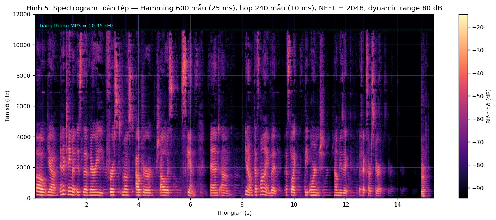
*Hình 5. Spectrogram toàn tệp, Hamming 25 ms / hop 10 ms, NFFT 2048, dynamic range cố định 80 dB.*

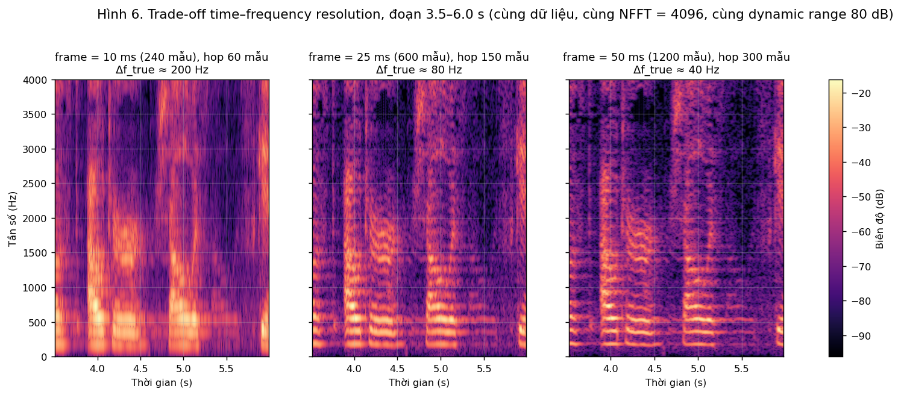
*Hình 6. So sánh ba frame length trên cùng đoạn 3.5–6.0 s — cùng dữ liệu, cùng NFFT = 4096, cùng dynamic range 80 dB.*

| Frame length | L (mẫu) | Δf_true≈ 2F_s/L | Độ phân giải thời gian |
|---|---|---|---|
| 10 ms | 240 | **200 Hz** | tốt nhất |
| 25 ms | 600 | 80 Hz | cân bằng |
| 50 ms | 1200 | **40 Hz** | kém nhất |

**Nhận xét.**

1. Spectrogram toàn tệp cho thấy năng lượng tập trung mạnh dưới 2 kHz, các **vạch nằm ngang song song**
   (chuỗi điều hòa ổn định) xen kẽ các **vạch dọc** — transient (tiếng gảy/gõ) trải rộng trên mọi tần số
   trong thời gian rất ngắn. Đường cắt 10.95 kHz nhìn thấy suốt chiều dài tệp, xác nhận kết luận ở phần 3.
2. Trade-off quan sát được trên hình 6 (đây là **controlled experiment**: chỉ frame length thay đổi):
   - **10 ms**: các vạch dọc sắc nét, định vị chính xác thời điểm bắt đầu mỗi nốt; nhưng các hoạ âm nhoè thành
     mảng liên tục, không đếm được.
   - **50 ms**: các vạch điều hòa tách bạch rõ ràng, đếm được từng hoạ âm; nhưng thời điểm bắt đầu nốt bị
     kéo giãn/mờ, transient biến mất.
   - **25 ms**: điểm cân bằng — đủ mịn theo tần số mà vẫn thấy nhịp. Đây là lý do 25 ms/10 ms là cấu hình
     mặc định trong xử lý tiếng nói.
3. Quan hệ định lượng: $\Delta f_{true} \propto 1/L$ còn độ phân giải thời gian $\propto L$.
   **Không thể cải thiện đồng thời cả hai** — hệ quả của nguyên lý bất định thời gian–tần số.
   Tăng NFFT không giúp gì cho vế thứ nhất (xem lại hình 4).

---

## 5. Thí nghiệm cửa sổ: rectangular vs Hamming (khối E)

Dùng **cùng một frame 25 ms** tại $t = 1.62$ s, **cùng NFFT = 16384** cho cả hai cửa sổ.

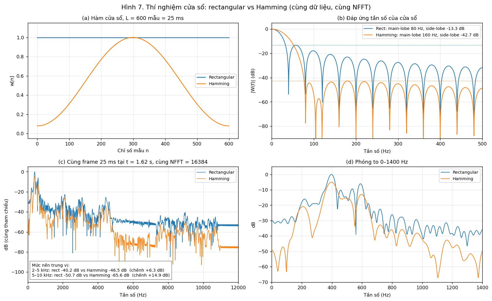
*Hình 7. (a) Hàm cửa sổ — (b) Đáp ứng tần số $|W(f)|$ — (c) Log-spectrum toàn băng — (d) Phóng to 0–1400 Hz.*

| Cửa sổ | Main-lobe (null–null) | Side-lobe cao nhất |
|---|---|---|
| Rectangular | **79.8 Hz** ($\approx 2F_s/L$) | **−13.3 dB** |
| Hamming | **160.4 Hz** ($\approx 4F_s/L$) | **−42.7 dB** |

**Mức nền trung vị của phổ frame (bằng chứng định lượng cho leakage):**

| Dải tần | Rectangular | Hamming | Chênh lệch |
|---|---|---|---|
| 2–5 kHz | −40.2 dB | −46.5 dB | **+6.3 dB** |
| 5–10 kHz | −50.7 dB | −65.6 dB | **+14.9 dB** |

**Nhận xét.**

1. Hình (b) tái hiện đúng lý thuyết sách giáo khoa: side-lobe đầu tiên của cửa sổ chữ nhật ở −13.3 dB,
   của Hamming ở −42.7 dB — **thấp hơn 29.4 dB**, đổi lại main-lobe rộng gấp đúng 2 lần.
2. Hình (c): trên cùng frame, cùng NFFT, đường rectangular có mức nền cao hơn Hamming 6.3 dB (2–5 kHz)
   và tới 14.9 dB (5–10 kHz). **Phần chênh lệch đó không phải tín hiệu thật**, mà là năng lượng rò từ các đỉnh
   mạnh ở dải thấp qua các side-lobe. Nếu dùng rectangular, ta sẽ kết luận sai rằng tệp có nhiều năng lượng
   cao tần hơn thực tế.
3. Hình (d): các đỉnh của Hamming tròn và rộng hơn. Nếu hai hoạ âm cách nhau nhỏ hơn 160 Hz, Hamming sẽ gộp
   chúng thành một, trong khi rectangular (main-lobe 80 Hz) vẫn tách được. **Đây chính là cái giá phải trả**
   để đổi lấy leakage thấp — không có cửa sổ nào tốt trên cả hai tiêu chí.

---

## 6. Lọc số FIR (khối F)

Thiết kế bằng phương pháp cửa sổ (`scipy.signal.firwin`), **201 taps, cửa sổ Hamming**, $F_s = 24$ kHz.
Số taps lẻ và hệ số đối xứng ⇒ FIR Type I, **pha tuyến tính**, group delay $=(201-1)/2 = 100$ mẫu $= 4.17$ ms.

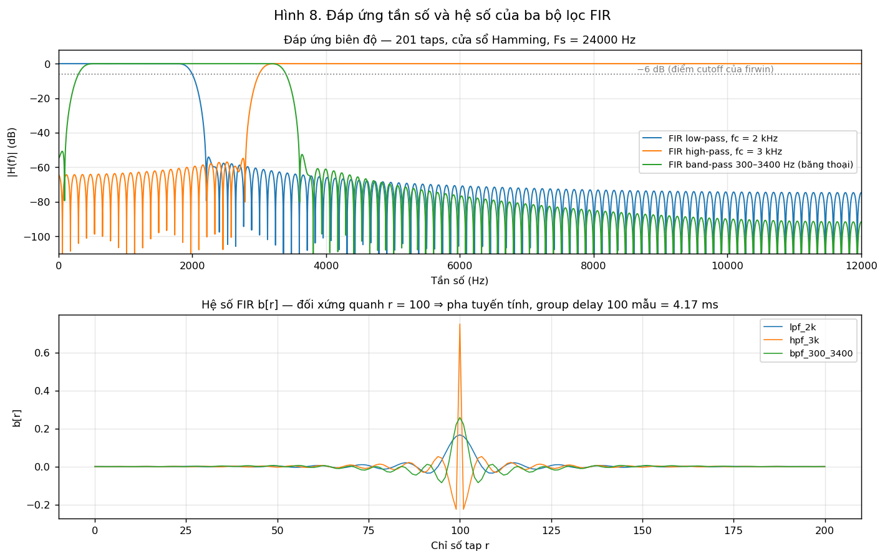
*Hình 8. Đáp ứng biên độ $|H(f)|$ và hệ số $b[r]$ của ba bộ lọc.*

**Đáp ứng đo được trên $H(f)$ (dB):**

| Bộ lọc | 500 Hz | 1 kHz | 2 kHz | 3 kHz | 4 kHz | 6 kHz | RMS ra (dBFS) |
|---|---|---|---|---|---|---|---|
| Low-pass $f_c$ = 2 kHz | −0.00 | −0.01 | **−6.03** | −75.69 | −66.72 | −76.80 | −21.92 |
| High-pass $f_c$ = 3 kHz | −65.34 | −69.47 | −65.24 | **−6.02** | −0.00 | 0.00 | **−35.39** |
| Band-pass 300–3400 Hz | −0.04 | −0.03 | −0.02 | −0.01 | −61.11 | −78.58 | −22.62 |

*(RMS tín hiệu gốc: −21.58 dBFS)*

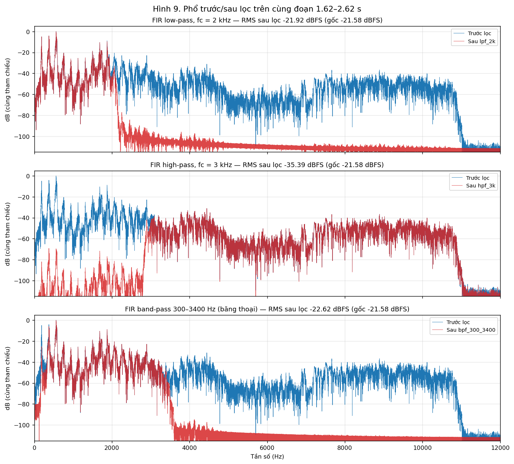
*Hình 9. Phổ trước/sau lọc trên cùng đoạn 1.62–2.62 s, cùng tham chiếu dB.*

**Tệp âm thanh xuất ra:** `music_lpf_2k.wav`, `music_hpf_3k.wav`, `music_bpf_300_3400.wav`
(tất cả **đã bù group delay 100 mẫu**).

**Nhận xét.**

1. Phổ sau lọc **bám sát đúng $H(f)$ đã thiết kế** — kiểm chứng trực tiếp quan hệ
   $Y(e^{j\omega}) = H(e^{j\omega})X(e^{j\omega})$. Với LPF, mọi thành phần trên ≈ 2.3 kHz bị dìm xuống dưới
   −75 dB; với HPF, dải dưới 1 kHz suy giảm ≈ 69 dB.
2. Cảm nhận nghe **khớp với phổ**:
   - LPF 2 kHz → nghe **tối/đục (muffled)**, mất hết phần sáng của nhạc cụ. RMS chỉ giảm 0.34 dB vì
     phần lớn năng lượng vốn đã nằm dưới 2 kHz.
   - HPF 3 kHz → nghe **mỏng, mất hẳn bass**; RMS tụt **13.8 dB**, con số này định lượng đúng nhận xét
     "phần lớn năng lượng nằm ở dải thấp".
   - BPF 300–3400 Hz → nghe như qua **điện thoại**, đúng với băng thoại tiêu chuẩn.
3. Lưu ý kỹ thuật: `firwin` định nghĩa cutoff tại điểm **−6 dB** (không phải −3 dB) — đo được đúng −6.03 dB
   tại 2 kHz và −6.02 dB tại 3 kHz. Vùng chuyển tiếp rộng ≈ 300 Hz là hệ quả của số taps hữu hạn.
4. **Bắt buộc bù group delay** trước khi so sánh dạng sóng hoặc tính sai số. Nếu bỏ qua, sai số do lệch
   100 mẫu sẽ lớn hơn nhiều so với sai số do chính bộ lọc gây ra — đây là một trong các lỗi thường gặp
   nêu ở mục 8 của đề Lab.

---

## 7. Lượng tử hóa và SNR (khối G.1)

$$\hat x[n]=Q\{x[n]\},\quad e[n]=\hat x[n]-x[n],\quad
\mathrm{SNR}=10\log_{10}\frac{\sum x^2[n]}{\sum e^2[n]}$$

$$\mathrm{SNR}_Q \approx 6.02B + 4.77 - 20\log_{10}\frac{X_{max}}{\sigma_x}$$

Với tệp này: $\sigma_x = 0.08341$, $X_{max}=1 \Rightarrow 20\log_{10}(X_{max}/\sigma_x) = \mathbf{21.58\ dB}$.

| $B$ | $L = 2^B$ | $\Delta$ | **SNR đo được** | SNR lý thuyết | Sai lệch | RMS lỗi |
|---|---|---|---|---|---|---|
| 2 | 4 | 1.0 | 0.13 dB | −4.77 dB | +4.90 | 8.22×10⁻² |
| 4 | 16 | 0.1429 | **8.86 dB** | 7.27 dB | +1.59 | 3.01×10⁻² |
| 6 | 64 | 0.0323 | 20.17 dB | 19.31 dB | +0.85 | 8.18×10⁻³ |
| 8 | 256 | 0.00787 | **31.74 dB** | 31.35 dB | +0.39 | 2.16×10⁻³ |
| 12 | 4096 | 4.885×10⁻⁴ | 55.49 dB | 55.43 dB | +0.06 | 1.40×10⁻⁴ |
| 16 | 65536 | 3.052×10⁻⁵ | **78.37 dB** | 79.51 dB | −1.14 | 1.01×10⁻⁵ |

**Độ dốc hồi quy:** 5.81 dB/bit (với $B \ge 4$); 5.68 dB/bit (toàn dải $B = 2\ldots16$). Lý thuyết: 6.02 dB/bit.

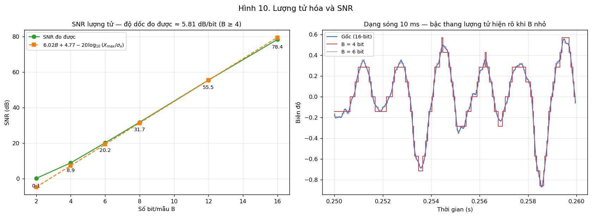
*Hình 10. SNR theo số bit và dạng sóng 10 ms cho thấy bậc thang lượng tử.*

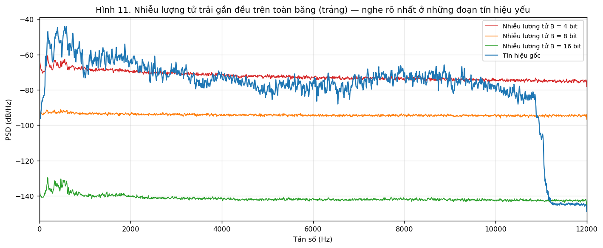
*Hình 11. PSD của nhiễu lượng tử — gần như phẳng trên toàn băng.*

**Trả lời câu hỏi phân tích "vì sao không đúng tuyệt đối 6 dB/bit":**

1. **Mô hình nhiễu lượng tử đều chỉ đúng gần đúng.** Nó giả định $e[n]$ phân bố đều trên $[-\Delta/2, \Delta/2]$
   và **không tương quan với tín hiệu**. Ở $B$ nhỏ (2–4 bit), chỉ còn 4–16 mức: lỗi lượng tử tương quan mạnh
   với tín hiệu và trở thành **méo hài**, không phải nhiễu trắng. Vì vậy sai lệch tại $B = 2$ lên tới +4.9 dB.
2. **Mức RMS thực tế.** $\sigma_x$ chỉ ở −21.58 dBFS nên số hạng $-20\log_{10}(X_{max}/\sigma_x)$
   **trừ đi tới 21.58 dB**. Đó là lý do tệp 8-bit chỉ đạt 31.7 dB chứ không phải ≈ 53 dB như công thức
   lý tưởng $6B+4.77$ gợi ý.
3. **Clipping level và phân bố tín hiệu.** Bộ lượng tử dùng toàn dải $[-1, 1]$ trong khi crest factor là 20 dB —
   phần lớn thời gian tín hiệu chỉ chiếm một phần nhỏ của dải động, tức là **nhiều mức lượng tử bị bỏ phí**.
   Nếu tín hiệu có phân bố khác (ví dụ tiếng nói có phân bố Laplace nhọn hơn), hằng số 4.77 cũng thay đổi.
4. **Trần của chính nguồn dữ liệu.** Ở $B = 16$, SNR đo được (78.37 dB) **thấp hơn** lý thuyết 1.14 dB, vì tín
   hiệu vào vốn đã là PCM 16-bit giải mã từ MP3 rồi lấy trung bình hai kênh — sàn nhiễu của nguồn đã nằm
   ở mức tương đương nên không thể đo được tỉ số cao hơn.

**Nhiễu lượng tử nghe rõ ở đâu?** Hình 11 cho thấy PSD nhiễu **phẳng trên toàn băng**. Vì vậy:
ở đoạn nhạc mạnh nó bị che (masking) gần như hoàn toàn; ở **đoạn B (14.4–14.9 s, −75.6 dBFS)** nó lộ hẳn ra
thành tiếng rè/hạt nền. Với `music_4bit.wav`, đoạn tắt dần gần như biến thành nhiễu thuần tuý.

---

## 8. Resampling và aliasing (khối G.2)

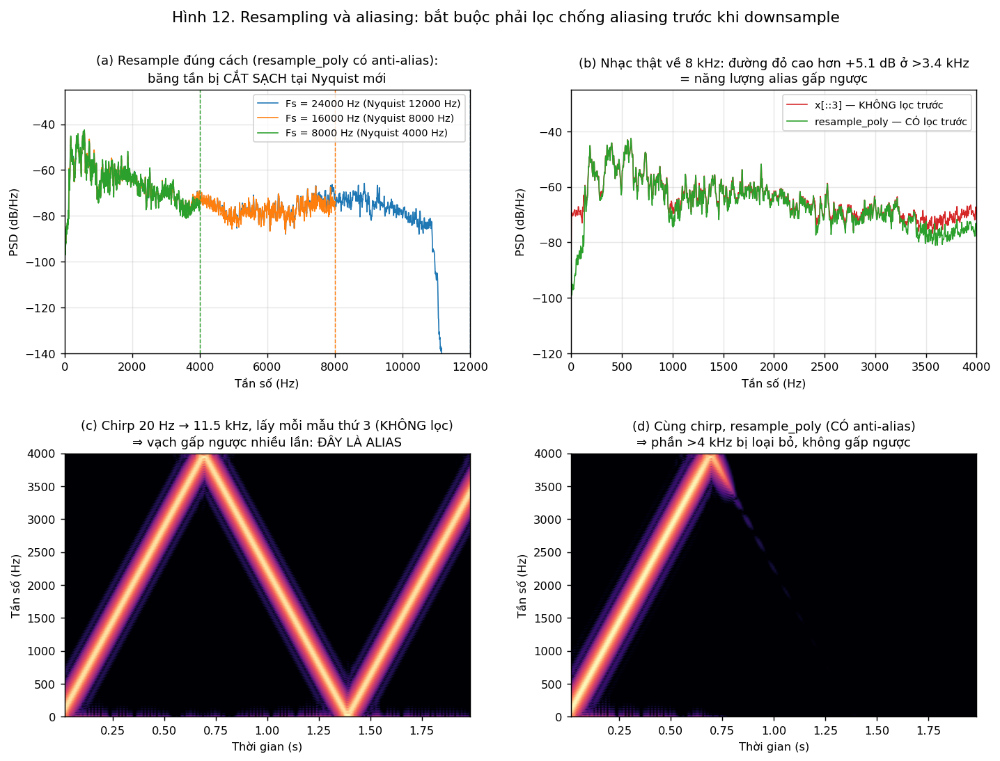
*Hình 12. (a) Resample đúng cách — (b) Nhạc thật về 8 kHz, có/không lọc trước — (c)(d) Chirp kiểm chứng.*

| Chuyển đổi | Số mẫu | Tỉ lệ | RMS |
|---|---|---|---|
| 24,000 → 16,000 Hz | 369,792 → 246,528 | 2/3 | −21.65 dBFS |
| 24,000 → 8,000 Hz | 369,792 → 123,264 | 1/3 | −21.72 dBFS |

**Alias có xuất hiện không? — CÓ, và đo được.**

1. **Bằng chứng không thể nhầm lẫn (panel c, d).** Dùng một chirp tuyến tính quét 20 Hz → 11.5 kHz làm tín hiệu
   kiểm chứng. Khi lấy mỗi mẫu thứ 3 mà **không lọc trước**, vạch chirp đi lên đến 4 kHz rồi **"gấp ngược"**
   đi xuống, rồi lại gấp lên — đúng hiện tượng $f_{alias} = |f - kF_{s2}|$. Nghe cũng rõ: tiếng quét lên biến
   thành tiếng quét xuống. Khi dùng `resample_poly` (có FIR anti-alias tích hợp), phần trên 4 kHz bị loại bỏ
   hẳn, đường chirp tắt dần chứ không gấp lại.
   - Tệp đối chứng: `chirp_8k_ALIASED_naive.wav` vs `chirp_8k_antialiased.wav`.
2. **Trên nhạc thật (panel b).** Alias kín đáo hơn vì năng lượng cao tần vốn đã yếu (đã bị MP3 cắt ở 11 kHz),
   nhưng vẫn **đo được mức nền dải trên 3.4 kHz cao hơn 5.1 dB** khi không lọc trước. Đó là năng lượng từ dải
   4.6–8 kHz gấp xuống, biểu hiện thành tiếng "sạn" kim loại lạ.

**Khi nào chất lượng nghe giảm rõ?**

- **16 kHz**: gần như không phân biệt được với bản gốc. Lý do định lượng: Nyquist mới là 8 kHz, mà phần năng
  lượng đáng kể của tệp nằm dưới 4 kHz; phần bị mất (8–11 kHz) chỉ là đuôi phổ mức thấp.
- **8 kHz**: **giảm rõ rệt** — mất hẳn độ sáng, nghe "đục", giống chất lượng điện thoại. Mọi thứ trên 4 kHz
  biến mất, bao gồm phần lớn thành phần transient làm nên tiếng "gảy" sắc nét.

---

## 9. Mã hóa: PCM vs MP3 (khối G.3)

$$R_{PCM}=F_s \times B \times C,\qquad \text{Size} \approx \frac{R_{PCM}\times \text{Duration}}{8}$$

$$R_{PCM} = 24{,}000 \times 16 \times 2 = 768{,}000\ \text{bit/s} = \mathbf{768.0\ kbps}$$
$$\text{Size} = 768{,}000 \times 15.408 / 8 = 1{,}479{,}168\ \text{byte} \approx \mathbf{1.479\ MB}$$

*(WAV thực tế: 1,479,212 byte — chênh 44 byte do header RIFF.)*

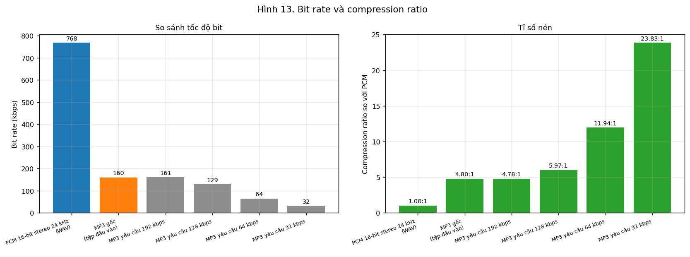
*Hình 13. Bit rate và compression ratio.*

| Định dạng | Kích thước (byte) | Bit rate đo được | Compression ratio | Tiết kiệm |
|---|---|---|---|---|
| PCM 16-bit stereo 24 kHz | 1,479,168 | 768.0 kbps | 1.00 : 1 | 0% |
| **MP3 gốc (tệp đầu vào)** | 308,160 | 160.0 kbps | **4.80 : 1** | **79.17%** |
| MP3 yêu cầu 192 kbps | 309,645 | 160.8 kbps | 4.78 : 1 | 79.07% |
| MP3 yêu cầu 128 kbps | 247,725 | 128.6 kbps | 5.97 : 1 | 83.25% |
| MP3 yêu cầu 64 kbps | 123,885 | 64.3 kbps | 11.94 : 1 | 91.62% |
| MP3 yêu cầu 32 kbps | 62,061 | 32.2 kbps | 23.83 : 1 | 95.80% |

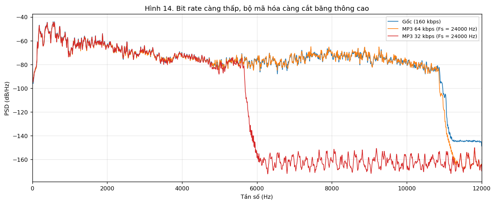
*Hình 14. Bit rate càng thấp, bộ mã hóa càng cắt băng thông cao.*

**Nhận xét.**

1. **Phát hiện đáng chú ý:** yêu cầu 192 kbps nhưng LAME vẫn cho ra 160.8 kbps. Không phải lỗi — ở
   $F_s = 24$ kHz, MP3 chạy ở chế độ **MPEG-2 LSF (Low Sampling Frequency)**, chuẩn này giới hạn bit rate
   tối đa **160 kbps**. Bài học phương pháp: **luôn đo bit rate thực tế từ kích thước tệp**, không tin vào
   tham số đã yêu cầu.
2. Hình 14 cho thấy chiến lược của bộ mã hóa perceptual: khi bit rate giảm, việc đầu tiên nó làm là **hi sinh
   băng thông cao** (bản 32 kbps thậm chí tự đổi sang $F_s = 16$ kHz) vì tai người ít nhạy ở đó — thay vì rải đều
   sai số ra toàn băng như PCM.
3. **So sánh quyết định:** PCM 8-bit mono ở 24 kHz tốn 192 kbps, SNR ≈ 31.7 dB, nghe rè rõ ở đoạn nhỏ tiếng.
   MP3 64 kbps chỉ tốn **1/3 số bit** nhưng nghe hay hơn hẳn. Lý do: MP3 giấu sai số vào những vùng bị masking
   theo mô hình tâm lý âm học, còn PCM rải nhiễu đều trên toàn băng (hình 11). **SNR không phải thước đo
   chất lượng nghe.**
4. **Cảnh báo phương pháp luận:** tệp gốc đã là MP3 (lossy), nên bản WAV giải mã ra **không phải ground truth
   không mất mát**. Mọi phép nén ở đây là nén lần hai (transcoding) và chỉ có giá trị so sánh tương đối.
   Chuyển MP3 → WAV chỉ đổi định dạng lưu trữ, không phục hồi được thông tin đã mất.

---

## 10. Trả lời câu hỏi báo cáo (mục 6 của đề Lab)

### Câu 1 — Vì sao $F_s = 44.1$ kHz chỉ biểu diễn độc lập đến 22.05 kHz?

Lấy mẫu $x[n] = x_a(nT)$ với $T = 1/F_s$ làm phổ của tín hiệu **lặp tuần hoàn với chu kỳ $F_s$**:

$$X_s(f) = F_s\sum_{k=-\infty}^{\infty} X_a(f - kF_s)$$

Hai tần số $f_1$ và $f_2 = f_1 + kF_s$ cho **cùng một chuỗi mẫu**, vì
$e^{j2\pi(f_1+kF_s)nT} = e^{j2\pi f_1 nT}\cdot e^{j2\pi kn} = e^{j2\pi f_1 nT}$.
Ngoài ra tín hiệu thực có phổ đối xứng Hermite ($X(-f) = X^*(f)$) nên $f$ và $-f$ cũng không phân biệt được.
Kết hợp hai điều: mọi tần số đều quy về khoảng $[0, F_s/2]$. Do đó điều kiện Nyquist $F_s \ge 2F_{max}$,
và với $F_s = 44{,}100$ Hz thì $F_{max} = F_s/2 = \mathbf{22{,}050}$ Hz.

*Liên hệ tệp này:* $F_s = 24$ kHz → Nyquist 12 kHz, và thực đo băng thông chỉ 10.95 kHz vì encoder còn cắt thêm.

### Câu 2 — NFFT tăng 2048 → 8192 nhưng frame vẫn 25 ms: cái gì đổi, cái gì không?

**Thay đổi:**
- $\Delta f = F_s/N_{FFT}$ giảm 4 lần. Với tệp này: 11.72 Hz → 2.93 Hz.
- Số bin tăng 4 lần → đường phổ **mịn hơn, đỉnh được nội suy chính xác hơn** (giảm sai số đọc vị trí đỉnh do
  "scalloping loss", tức đỉnh thật rơi giữa hai bin).
- Chi phí tính toán và bộ nhớ tăng.

**KHÔNG thay đổi:**
- **Độ phân giải thực** $\Delta f_{true} \approx \alpha F_s/L$. Frame vẫn 25 ms ($L = 600$ mẫu) nên vẫn ≈ 80 Hz.
  Hai hình sin cách nhau 40 Hz vẫn **không tách được** dù NFFT có lớn đến đâu.
- Bề rộng main-lobe (tính bằng Hz), do đó khả năng phân giải hai đỉnh gần nhau.
- Độ phân giải thời gian và lượng thông tin thực có trong frame.

**Bằng chứng trong Lab:** hình 4, panel dưới — ba đường NFFT 2048/8192/32768 chồng khít lên cùng một hình
dạng main-lobe quanh 189 Hz, không đỉnh nào tách ra thêm. Zero-padding **nội suy** chứ không **phân giải**.

### Câu 3 — Vì sao Hamming giảm leakage nhưng làm các đỉnh gần nhau khó tách hơn?

Nhân tín hiệu với cửa sổ $w[n]$ trong miền thời gian ⇔ **tích chập phổ tín hiệu với $W(e^{j\omega})$**
trong miền tần số. Do đó mỗi thành phần hình sin không còn là một vạch mà trở thành **một bản sao thu nhỏ
của $W(e^{j\omega})$** đặt tại tần số đó. Hình dạng $W$ quyết định tất cả:

- **Side-lobe** quyết định **leakage**: năng lượng rò sang các bin xa. Rectangular có side-lobe −13.3 dB
  (rất cao, và suy giảm chậm ~6 dB/octave); Hamming có −42.7 dB (nhờ cửa sổ đi về 0 mượt ở hai đầu,
  triệt tiêu gián đoạn giả tạo). **Đo được trong Lab:** mức nền dải 5–10 kHz của rectangular cao hơn
  Hamming **14.9 dB** trên cùng một frame.
- **Main-lobe** quyết định **khả năng phân giải**: hai đỉnh cách nhau nhỏ hơn bề rộng main-lobe sẽ gộp thành một.
  **Đo được trong Lab:** rectangular 79.8 Hz, Hamming 160.4 Hz — **rộng gấp đôi**.

Nguyên nhân sâu xa là **quan hệ đánh đổi cố hữu**: làm cửa sổ "mượt" hơn ở hai đầu để hạ side-lobe thì trong miền
tần số năng lượng bị dồn vào main-lobe rộng hơn. Không có cửa sổ nào tốt trên cả hai tiêu chí cùng lúc.

**Chọn thế nào:** cần phát hiện thành phần yếu bên cạnh thành phần mạnh (ví dụ hoạ âm bậc cao cạnh $f_0$)
→ ưu tiên side-lobe thấp (Hamming/Hann/Blackman). Cần tách hai đỉnh **cùng biên độ** rất gần nhau
→ ưu tiên main-lobe hẹp (rectangular).

### Câu 4 — FIR 201 taps đối xứng: trễ bao nhiêu ms? Có quan trọng trong thời gian thực không?

$$\text{group delay} = \frac{L-1}{2} = \frac{201-1}{2} = 100\ \text{mẫu}$$

- Tại $F_s = 24$ kHz (tệp này): $100/24{,}000 = \mathbf{4.17\ ms}$.
- Tại $F_s = 44.1$ kHz (như đề bài nêu): $100/44{,}100 = \mathbf{2.27\ ms}$.

**Có quan trọng không — tùy ứng dụng:**

| Ứng dụng | Ngưỡng chấp nhận | 4.17 ms có sao không? |
|---|---|---|
| Nghe lại chính giọng mình (in-ear monitor, hát karaoke) | ~5–10 ms | **Sát ngưỡng** — cộng thêm trễ của ADC/DAC/buffer là bắt đầu khó chịu |
| Live monitoring nhạc cụ, hearing aid | < 10 ms | Chấp nhận được nếu tổng ngân sách trễ được kiểm soát |
| Hội thoại VoIP | < 150 ms (ITU-T G.114) | Hoàn toàn không đáng kể |
| Xử lý offline (file-based) | không giới hạn | Không ảnh hưởng, chỉ cần bù lại |

Điểm quan trọng: **4.17 ms là trễ của riêng một bộ lọc**. Trong hệ thực tế phải cộng dồn trễ của ADC/DAC,
buffer, các tầng xử lý khác — "ngân sách trễ" mới là thứ cần quản lý. Nếu trễ trở thành vấn đề, giải pháp là
giảm số taps (đổi lại vùng chuyển tiếp rộng hơn) hoặc chuyển sang IIR (trễ thấp hơn nhiều nhưng **mất pha
tuyến tính** ⇒ méo dạng sóng).

Trong xử lý offline, trễ vẫn phải **bù** (dịch tín hiệu ra đi 100 mẫu) trước khi so sánh hay tính SNR — như đã
làm ở phần 6. Không bù thì sai số do lệch thời gian sẽ lấn át sai số thật của bộ lọc.

### Câu 5 — Ảnh hưởng của $B$ và $\sigma_x$ trong $\mathrm{SNR}_Q$. Vì sao giảm mức tín hiệu vào làm SNR giảm?

$$\mathrm{SNR}_Q(\text{dB}) = 6.02B + 4.77 - 20\log_{10}\frac{X_{max}}{\sigma_x}$$

**Ảnh hưởng của $B$:** mỗi bit thêm vào **chia đôi bước lượng tử** $\Delta = 2X_{max}/2^B$, làm công suất
nhiễu $\sigma_e^2 \approx \Delta^2/12$ **giảm 4 lần** = 6.02 dB. Đây là số hạng duy nhất ta kiểm soát được
bằng thiết kế. *Đo được trong Lab: 5.81 dB/bit với $B \ge 4$.*

**Ảnh hưởng của $\sigma_x$:** bước lượng tử $\Delta$ **chỉ phụ thuộc $X_{max}$ và $B$, không phụ thuộc $\sigma_x$**.
Nghĩa là công suất nhiễu $\sigma_e^2$ là **hằng số** bất kể tín hiệu to hay nhỏ. Do đó khi giảm mức tín hiệu vào:

- Tử số $\sigma_x^2$ giảm.
- Mẫu số $\sigma_e^2$ **giữ nguyên**.
- ⇒ SNR **giảm đúng bằng số dB mà tín hiệu bị giảm**.

Diễn giải trực quan: hạ mức tín hiệu xuống 20 dB nghĩa là tín hiệu chỉ còn dùng **1/10 dải động** của bộ lượng
tử — tương đương **vứt đi hơn 3 bit** ($20/6.02 \approx 3.3$ bit), các mức lượng tử phía trên hoàn toàn bỏ phí.

*Kiểm chứng trên tệp này:* $\sigma_x = -21.58$ dBFS nên số hạng $-20\log_{10}(X_{max}/\sigma_x)$ trừ đi
**21.58 dB**. Kết quả: $B = 8$ chỉ cho 31.7 dB thay vì $6\cdot8+4.77 = 52.9$ dB.

**Hệ quả thực hành:** phải **thu ở mức càng gần full-scale càng tốt** mà không clipping (tối ưu headroom).
Đây chính là lý do kỹ thuật của gain staging trong thu âm, và lý do các hệ thống thực dùng lượng tử **không đều**
(µ-law/A-law) hoặc **thích nghi** (ADPCM) để SNR ít phụ thuộc vào mức tín hiệu.

### Câu 6 — WAV 16-bit stereo 44.1 kHz dài 60 s: kích thước PCM lý thuyết? So với MP3 128 kbps?

$$R_{PCM} = 44{,}100 \times 16 \times 2 = 1{,}411{,}200\ \text{bit/s} = 1{,}411.2\ \text{kbps}$$
$$\text{Size} = \frac{1{,}411{,}200 \times 60}{8} = 10{,}584{,}000\ \text{byte}$$

| Đơn vị | Giá trị |
|---|---|
| **MB thập phân** ($10^6$ byte) | **10.584 MB** |
| **MiB nhị phân** ($2^{20}$ byte) | **10.094 MiB** |
| (chưa tính header WAV ≈ 44 byte, không đáng kể) |

**So với MP3 128 kbps (60 s):**

$$\text{Size}_{MP3} = \frac{128{,}000 \times 60}{8} = 960{,}000\ \text{byte} = \mathbf{0.960\ MB}$$

| | PCM WAV | MP3 128 kbps |
|---|---|---|
| Bit rate | 1,411.2 kbps | 128 kbps |
| Kích thước 60 s | 10.584 MB | 0.960 MB |
| **Compression ratio** | 1 : 1 | $1411.2/128 = \mathbf{11.03 : 1}$ |
| **Tiết kiệm** | — | **90.9%** |

*Lưu ý:* kích thước MP3 thực tế lệch nhẹ do header ID3, frame padding và chế độ VBR nếu dùng.
Trong Lab này, tệp 15.408 s ở 160 kbps đo được 308,160 byte — khớp chính xác với công thức.

### Câu 7 — Hai trường hợp "nghe tốt hơn" ≠ "SNR lớn hơn"

**Trường hợp 1 — Nén perceptual (lossy) so với PCM cùng dung lượng.**
MP3 64 kbps có SNR dạng sóng **rất thấp** (chỉ vài dB, vì nó thay đổi hẳn dạng sóng: lượng tử không đều theo
sub-band, cắt băng thông, joint-stereo). PCM 8-bit mono có SNR **31.7 dB** (đo được ở phần 7), gấp nhiều lần.
Nhưng nghe thử thì MP3 64 kbps hay hơn hẳn dù tốn ít hơn 1/3 số bit. Lý do: MP3 đặt sai số **nằm dưới ngưỡng
masking** của tai theo từng dải tần và từng thời điểm, còn PCM rải nhiễu đều trên toàn băng (hình 11), khiến
nó lộ ra ở mọi đoạn nhỏ tiếng. **SNR đo sai số toán học, không đo cái tai nghe thấy.**

**Trường hợp 2 — Noise shaping và dithering.**
Khi hạ bit depth (ví dụ 24 → 16 bit), thêm **dither** (nhiễu ngẫu nhiên mức rất thấp) trước khi lượng tử làm
**SNR giảm** (vì cố tình cộng thêm nhiễu), nhưng nghe **tốt hơn rõ rệt**: dither phá vỡ tương quan giữa lỗi
lượng tử và tín hiệu, biến méo hài (nghe như tiếng "vỡ", rất khó chịu và dễ nhận ra) thành nhiễu nền êm.
Kết hợp thêm **noise shaping** — đẩy năng lượng nhiễu lên dải 15–20 kHz nơi tai kém nhạy — làm SNR băng rộng
tệ hơn nữa nhưng nhiễu **nghe được** lại giảm 10–15 dB.

**Trường hợp 3 (bổ sung) — Lệch pha/thời gian.**
Một bộ lọc IIR hoặc một xử lý gây trễ nhỏ có thể cho SNR dạng sóng rất tệ (vì tín hiệu lệch thời gian, sai số
lớn) trong khi tai **hoàn toàn không nghe ra khác biệt** — tai người rất kém nhạy với sai lệch pha tuyệt đối.
Ngược lại, một xử lý giữ SNR cao nhưng gây méo phi tuyến nhẹ lại nghe rõ ngay.

**Kết luận chung:** SNR là thước đo **sai lệch dạng sóng**, còn chất lượng nghe phụ thuộc **đặc tính tâm lý
âm học** (masking theo tần số và theo thời gian, độ nhạy khác nhau theo dải tần, khả năng phát hiện méo hài so
với nhiễu nền). Vì vậy ngành audio coding dùng các thước đo riêng như **PEAQ, POLQA, PESQ** hoặc
**MUSHRA/ABX test** thay vì SNR.

---

## 11. Bảng tổng hợp toàn Lab

| Đại lượng | Giá trị đo được |
|---|---|
| $F_s$ / Nyquist | 24,000 Hz / 12,000 Hz |
| Kênh, bit sau giải mã | 2 (stereo), 16 bit/mẫu |
| Thời lượng, số mẫu | 15.408 s, 369,792 mẫu/kênh |
| Kích thước MP3 | 308,160 byte (160.0 kbps) |
| Peak / RMS (mono) | −1.23 dBFS / −21.58 dBFS |
| Crest factor | 20.34 dB |
| Clipping | không (0 mẫu chạm full-scale) |
| Đoạn FFT | 1.62–2.62 s (1.0 s) |
| $\Delta f$ @ NFFT 2048 / 32768 | 11.72 Hz / 0.732 Hz |
| Độ phân giải THỰC ($L$ = 1 s) | ≈ 2.00 Hz |
| $f_0$ và hoạ âm | 189, 376, 561, 758 Hz |
| Băng thông hiệu dụng | ≈ 10,951 Hz (< Nyquist ⇒ dấu vết MP3) |
| STFT chuẩn | $L$ = 600 mẫu (25 ms), $H$ = 240 mẫu (10 ms), overlap 60% |
| $\Delta f_{true}$ 10 / 25 / 50 ms | 200 / 80 / 40 Hz |
| Cửa sổ: main-lobe | rect 79.8 Hz vs Hamming 160.4 Hz |
| Cửa sổ: side-lobe | rect −13.3 dB vs Hamming −42.7 dB |
| Leakage đo được (5–10 kHz) | rect cao hơn Hamming 14.9 dB |
| FIR 201 taps | group delay 100 mẫu = 4.17 ms |
| SNR lượng tử 4 / 8 / 16 bit | 8.9 / 31.7 / 78.4 dB |
| Độ dốc SNR ($B \ge 4$) | 5.81 dB/bit (lý thuyết 6.02) |
| $20\log_{10}(X_{max}/\sigma_x)$ | 21.58 dB |
| $R_{PCM}$ stereo | 768.0 kbps ⇒ 1.479 MB |
| Alias vượt mức (>3.4 kHz, không lọc) | +5.1 dB |
| Compression ratio MP3 gốc | 4.80 : 1 (tiết kiệm 79.17%) |

---

## 12. Kiểm tra theo checklist của đề Lab

| Yêu cầu | Trạng thái |
|---|---|
| Notebook chạy lại được từ đầu đến cuối | ✅ đã chạy Run All, không lỗi, mọi hình sinh lại từ code |
| Không thiếu audio đầu ra | ✅ 19 tệp trong `audio/`, tên thể hiện rõ cấu hình |
| Mọi hình có tiêu đề, tên trục, đơn vị, tham số | ✅ |
| Có phép tính kiểm chứng | ✅ SNR đo vs lý thuyết; size WAV tính vs thực tế; main/side-lobe đo vs sách |
| Kết luận gắn với số liệu/đồ thị | ✅ mọi nhận xét đều dẫn số đo hoặc chỉ ra dấu hiệu trên hình |
| Ghi rõ mọi tham số xử lý | ✅ |
| So sánh giữ các tham số khác cố định | ✅ NFFT/dynamic range/dữ liệu giữ nguyên khi so frame length và cửa sổ |
| Ghi rõ dBFS / relative dB / SNR dB | ✅ khai báo ở đầu báo cáo và ghi kèm mọi giá trị |

**Các lỗi thường gặp (mục 8 đề Lab) đã chủ động tránh:**

- Không dùng một FFT cho cả tệp rồi kết luận về thời điểm — đã chọn đoạn ổn định 1 s cho FFT, dùng STFT cho
  phân tích theo thời gian.
- So sánh spectrogram **giữ nguyên dynamic range 80 dB và cùng colormap** cho cả ba frame length.
- Không kết luận NFFT lớn làm tăng độ phân giải vật lý — đã chứng minh ngược lại bằng hình 4.
- Không downsample bằng cách bỏ mẫu — đã dùng `resample_poly`, và **cố tình làm sai** một lần để đối chứng
  (`*_ALIASED_naive.wav`).
- Thiết kế filter có **truyền đúng `fs=Fs`**, ghi rõ cutoff tính bằng Hz và quy ước −6 dB của `firwin`.
- **Đã bù group delay** trước khi so sánh/tính sai số.
- So sánh WAV vs MP3 có ghi rõ channel, sampling rate, bit depth và bitrate thực đo.
- Không coi MP3 là ground truth không mất mát — đã nêu rõ ở phần 1 và phần 9.

---

## 13. Cấu trúc sản phẩm nộp

```
Lab01_CSE457/
├── Lab01_CSE457.ipynb          # notebook chạy từ đầu đến cuối
├── report_Lab01.md             # báo cáo này
├── results_summary.json        # toàn bộ số liệu do notebook sinh ra
├── README.md
├── audio/
│   ├── input.mp3                        # dữ liệu gốc
│   ├── mono_norm.wav                    # mono chuẩn hóa
│   ├── pcm16_stereo_24k.wav             # PCM không nén (mốc quy chiếu)
│   ├── music_lpf_2k.wav                 # FIR low-pass 2 kHz
│   ├── music_hpf_3k.wav                 # FIR high-pass 3 kHz
│   ├── music_bpf_300_3400.wav           # FIR band-pass băng thoại
│   ├── music_4bit.wav / 8bit / 16bit    # lượng tử đều
│   ├── music_16k.wav / music_8k.wav     # resample đúng cách
│   ├── music_8k_ALIASED_naive.wav       # đối chứng: có alias
│   ├── chirp_24k_ref.wav                # chirp kiểm chứng
│   ├── chirp_8k_ALIASED_naive.wav
│   ├── chirp_8k_antialiased.wav
│   └── music_mp3_{192,128,64,32}k.mp3   # các mức nén
└── figures/
    ├── 01_waveform_full.png          08_filter_response.png
    ├── 02_time_domain.png            09_filter_before_after.png
    ├── 03_fft_spectrum.png           10_quantization_snr.png
    ├── 04_nfft_compare.png           11_quant_noise_psd.png
    ├── 05_spectrogram_25ms.png       12_resampling.png
    ├── 06_frame_length_compare.png   13_bitrate_compression.png
    └── 07_window_compare.png         14_mp3_bandwidth.png
```

---

## 14. Tài liệu tham khảo

1. Đề cương chi tiết học phần CSE457 — Xử lý âm thanh và tiếng nói, Trường Đại học Thủy lợi, 2023.
2. L. R. Rabiner, R. W. Schafer, *Theory and Applications of Digital Speech Processing*, Pearson, 2010 —
   Ch. 2 (DSP fundamentals), Ch. 7 (STFT), Ch. 11 (quantization/speech coding), Ch. 12 (audio coding).
3. X. Huang, A. Acero, H.-W. Hon, *Spoken Language Processing*, Prentice-Hall, 2001 — Ch. 5, 7.
4. D. Jurafsky, J. H. Martin, *Speech and Language Processing*, Prentice-Hall, 2008.
5. F. J. Harris, "On the use of windows for harmonic analysis with the DFT", *Proc. IEEE*, 66(1), 1978 —
   nguồn của các số liệu main-lobe/side-lobe đã kiểm chứng lại ở phần 5.
